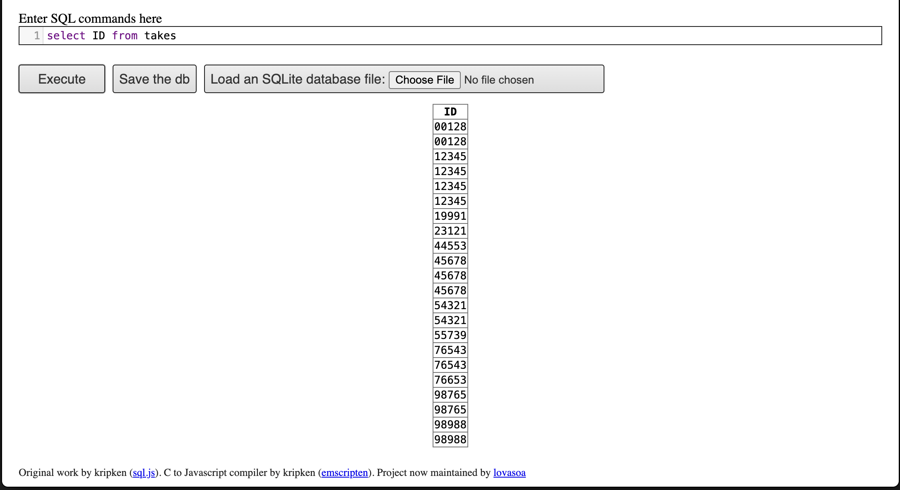
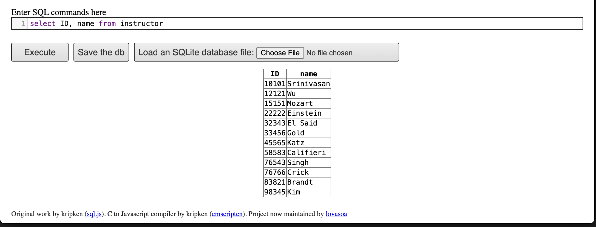

## Question 1.

Write SQL codes to get a list of the following:

a.  Student IDs

b.  Instructors

c.  Departments

## Question 2.

Write SQL codes for the following:

a.  Find the ID and name of each student who has taken at least one Comp. Sci. course; no duplicates!

b.  Add grades

c.  Find the ID and name of each student who has not taken any course offered before 2017.

d.  Find the maximum salary for each instructor in each department. Assume each department has at least one instructor

e.  Find the lowest, across all departments, of the per dept maximum salary computed by the preceding query

f. add names to the list

## Question 5

Write the SQL code to find the number of students in each section. Results column should appear in the order, "course ID, sec ID, year, semester, num"

