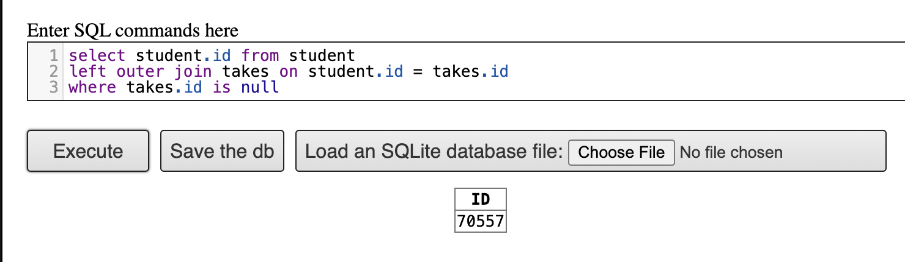

## Question 1 - Strong vs Weak Entity Set?

**Weak entity set:** one whose existence that is dependent on another entity set, called its identifying entity set instead of associating a primary key with a weak entity. We use the PK of the identifying entity along with discriminator attributes to uniquely identify a weak entity

**Strong entity set:** the opposite of a weak entity set. It has a **PK** and does not depend on any other entity for its existence.

------------------------------------------------------------------------

**Ex. Hospital Management System:**

Patient Table in a Hospital Management System (Strong Entity) is the primary key because **each patient has a unique Patient ID**, it does not depend on another entity.

Weak entities:

**Prescription:** A prescription is given to a patient by a doctor **relies** on the doctor and **cannot exist without the doctor as it depends on the Patient ID and Doctor ID.**

**Surgery:** Different patients might have the same surgery, so it **depends on the patient ID and Doctor ID.**

## Question 2 - Orlando Magic vs Dallas Mavericks

**Mavericks**

Players: 

**Magic**

Players:

**Game Statistics:**

**ER Diagram:**

## Question 2b: All 30 NBA Teams?

\

## Question 3 - SQL Exercise

Why does appending natural join section in the from clause would not change the result?

**Natural Join:** this operation operates on two relations and produces a relations as the result. It only considered the pairs of tuples with the same value on those attributes that appear in the schemas of both relations.

-   Automatically matches columns with the same name in both tables

-   Removes duplicated columns in the output

Therefore, the result is not changed because "takes" and "section" share the same attributes, therefore "Natural Join" would not add new information:

Shared Attributes:

-   courseID

-   secID

-   semester

-   year

## Question 3b

Write an SQL query using the university schema to find the ID of each student who has never taken a course at the university.

Ex. 

-   Using a left outer join ensures that all students appear in the result.

-   (takes.ID IS NULL) filters out the students who have at least one course in takes, leaving those who have never taken a course at the university.
