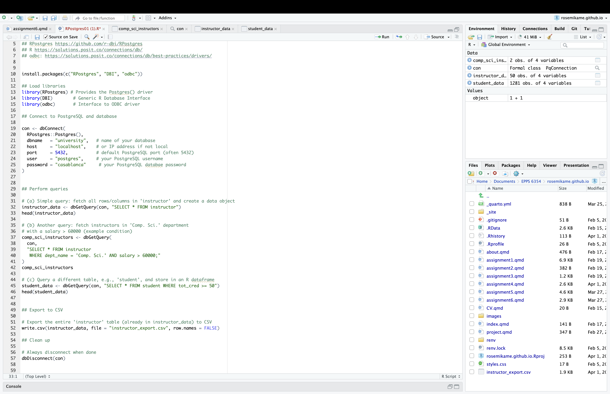
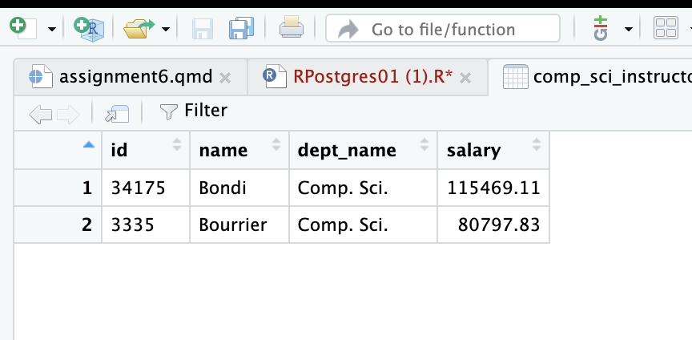
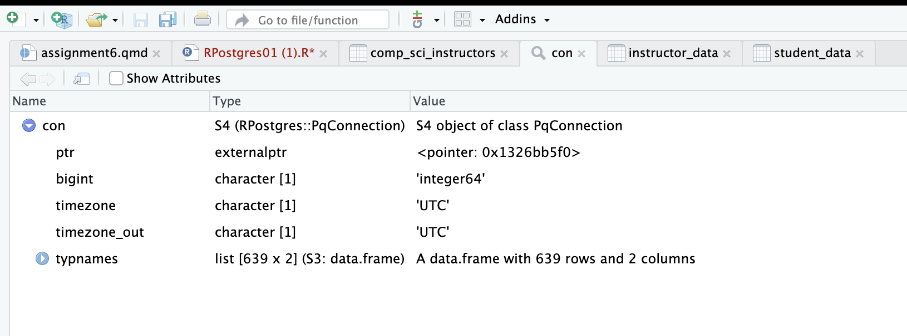
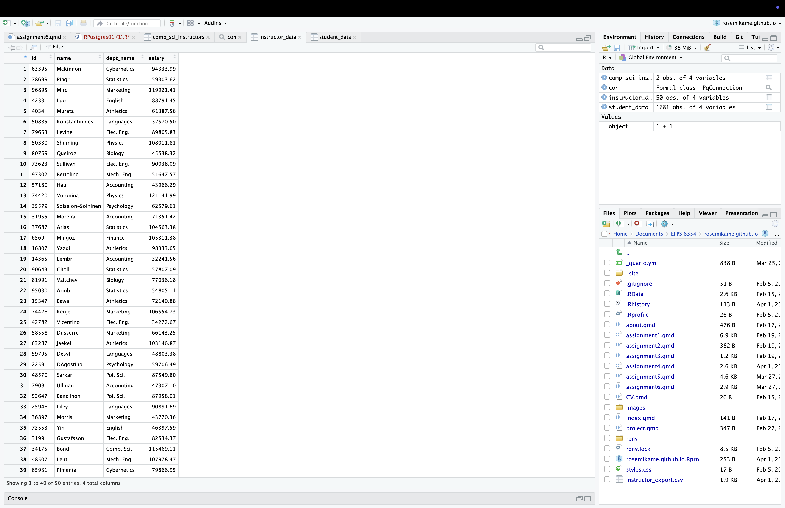
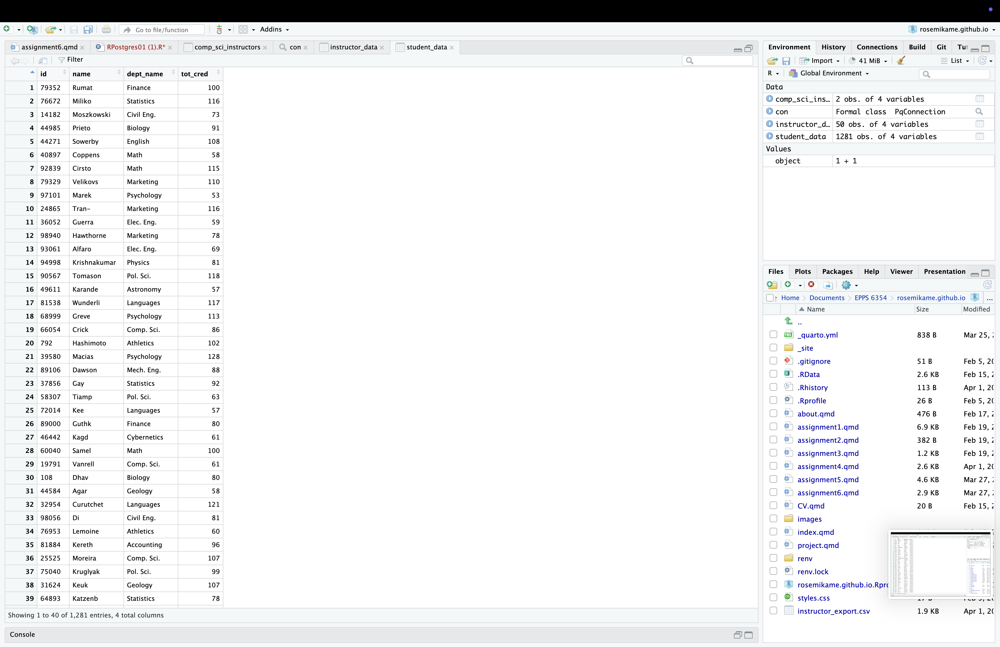

## Question 1 - Websites containing JSON & XML:

**a. JSON - Tik Tok**

Tik Tok uses JSON for data exchange between servers and users. Using JSON is efficient for the social media platform because it transmits data quickly and allows it to be well structured for efficient processing. It organizes the data into different categories, such as videos, likes, and comments etc. that is needed to make Tik Tok an enjoyable experience. It also allows users to share across different platforms!

Structure and Composition of Tik Tok :

1.  [Front-end (User Experience):]{.underline} The purpose is to provide a fast and smooth engaging user experience. Built with HTML, CSS, and JavaScript.

    Ex: FYP page and interactions

2.  [Back-end (Processing):]{.underline} The purpose is to manage user interactions, store videos, and real-time updates. Built with Python and Java.

    Ex: User information, content delivery, and security and data encryption

3.  [Database System (Data Storage):]{.underline} The purpose is to store user data, videos, engagement metrics, and recommendation data.

Main Database Technologies used:

-   SQL/Postgre SQL for structured data (user accounts, interactions). Relational Databases

-   NoSQL - for handling highspeed and unstructured data

**b. XML - CNN**

CNN uses XML for the distribution, storage, and sharing of news and updates. This allows for a quick and efficient data transfer to allow for more information to get across to the world.

Structure and Composition of CNN:

1.  News Updates: Provides news feeds in XML format, allowing for users to obtain real time news updates.
2.  Storing News Content: XML databases allows news websites to store articles and content. This makes retrieval of information efficient.
3.  Data Exchange: This allows for CNN to share its content across different platforms!

Main Database Technologies used:

-   SQL/Postgre SQL for structured data (user accounts, interactions). Relational Databases

-   NoSQL - for handling highspeed and unstructured data

-   XML Databases - for storing news articles, headlines, and metadata

## Question 2 - Express the following query in SQL using no subqueries and no set operations using outer join:

**SELECT student.ID\
FROM student\
LEFT OUTER JOIN advisor ON student.ID = advisor.s_id\
WHERE advisor.s_id IS NULL**

-   Left Outer Join includes all students even though they dont have a match in advisor.

-   The (**WHERE advisor.s_id IS NULL)** filters out students who do have an advisor, leaving only those who dont.

ii. Write a SQL query to find the names and IDs of the instructors who teach every course taught in their department. Order results by name:

**SELECT i.ID, i.name\
FROM instructor i\
WHERE NOT EXISTS (\
SELECT c.course_id\
FROM course c\
WHERE c.dept_name = i.dept_name\
AND NOT EXISTS (\
SELECT\*\
FROM teaches t WHERE t.ID = i.ID AND t.course_id = c.course_id**

## Question 3 - R and PostgreSQL Results:

