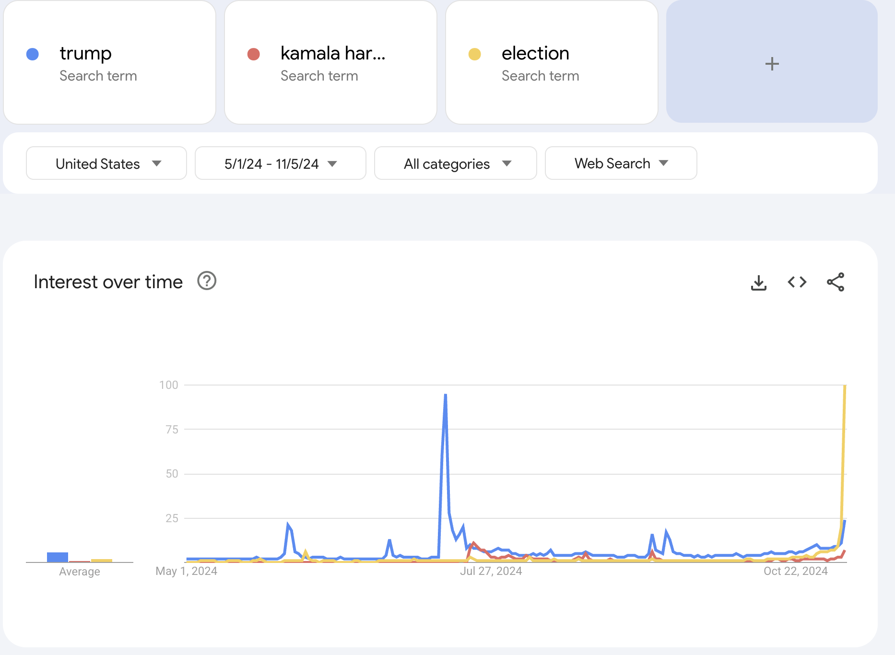
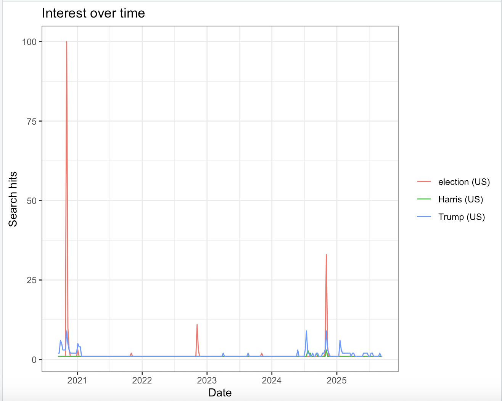
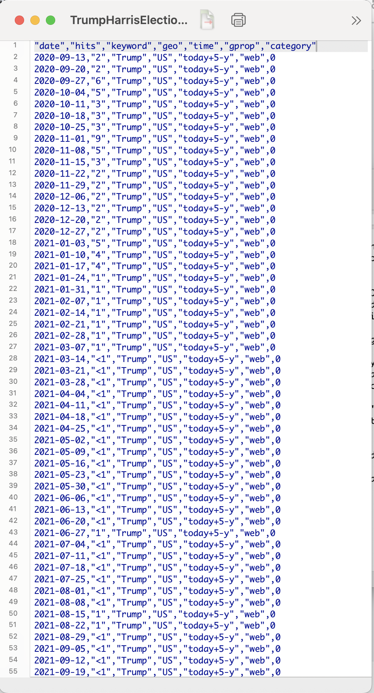

## 1. Analyzing data for the following terms using Google trends:

\`\`\`\
- Donald Trump (Blue)

-   Kamala Harris (Red)

-   Elections (Yellow)

-   

**Analysis of Dates:**

The data was analyzed for 6 months before leading up before the election **(5/1/2024 - 11/5/2024).**

**Analysis of Intervals:**

The intervals are weekly, each segment is every 7 days.

-   *May-Early July:* The data is fairly low however Trump is mostly leading in searches

-   *Mid-July:* Large spike for Trump

-   *Late July-August:* Trump remains high, with Kamala Harris rising

-   *Sept-Oct:* Election begins a climb in late Oct

-   *Election week:* Election jumps, with Trump and Kamala Harris gaining momentum however not as high as "election".

------------------------------------------------------------------------

## 2. Using gtrendsR01.r package to collect the data:

gtrendsR01.r:

**install.packages("gtrendsR") library(gtrendsR) TrumpHarrisElection = gtrends(c("Trump","Harris","election"), onlyInterest = TRUE, geo = "US", gprop = "web", time = "today+5-y", category = 0, ) \# last five years the_df=TrumpHarrisElection\$interest_over_time plot(TrumpHarrisElection) tg = gtrends("tariff", time = "all")**

2.  CSV and R formats:

CSV format: write.csv(the_df, "TrumpHarrisElection.csv", row.names = FALSE)

Rds format:

saveRDS(the_df, "TrumpHarrisElection.rds")

## 3. What are the differences between the two methods?

-   The pros are that there is no coding required and it is a quick export to CSV using the Google Trends Website. However, it is less flexible and it is not easily automated or able to repeat your queries.
-   Using gtrendsR in R, it is fully programmble which means there is reporoducible research. You can automate between multiple quieries and it is easy to save. However, you will need to know how to use R which everyone can learn!
