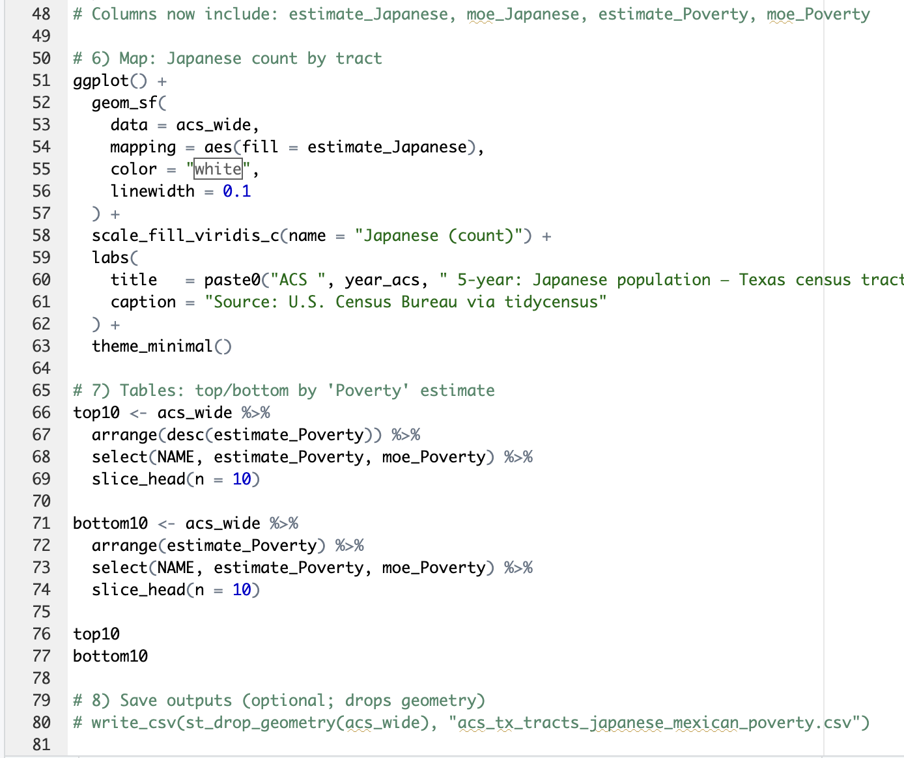
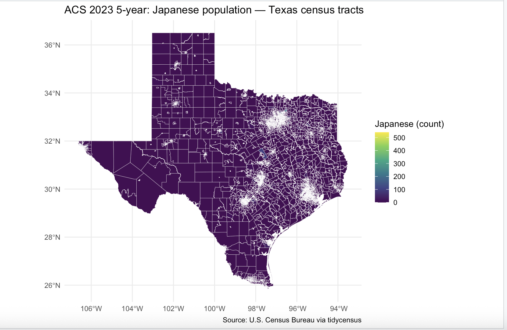
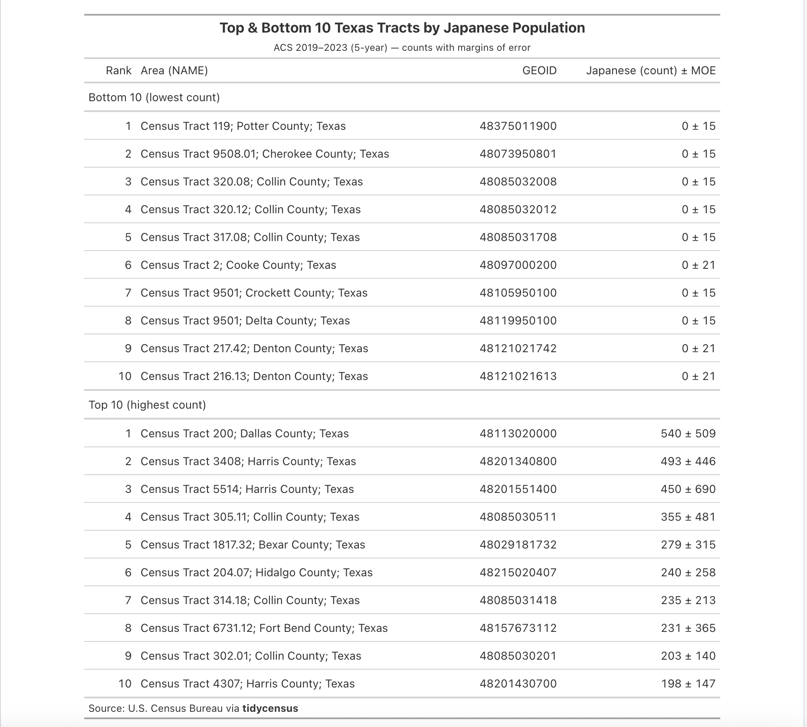
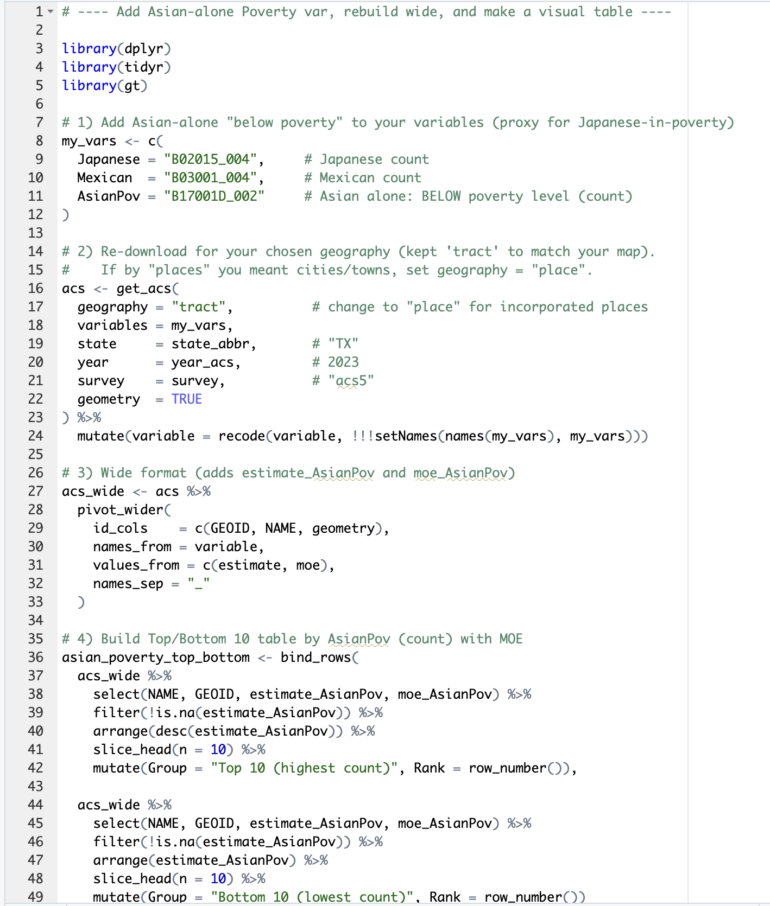
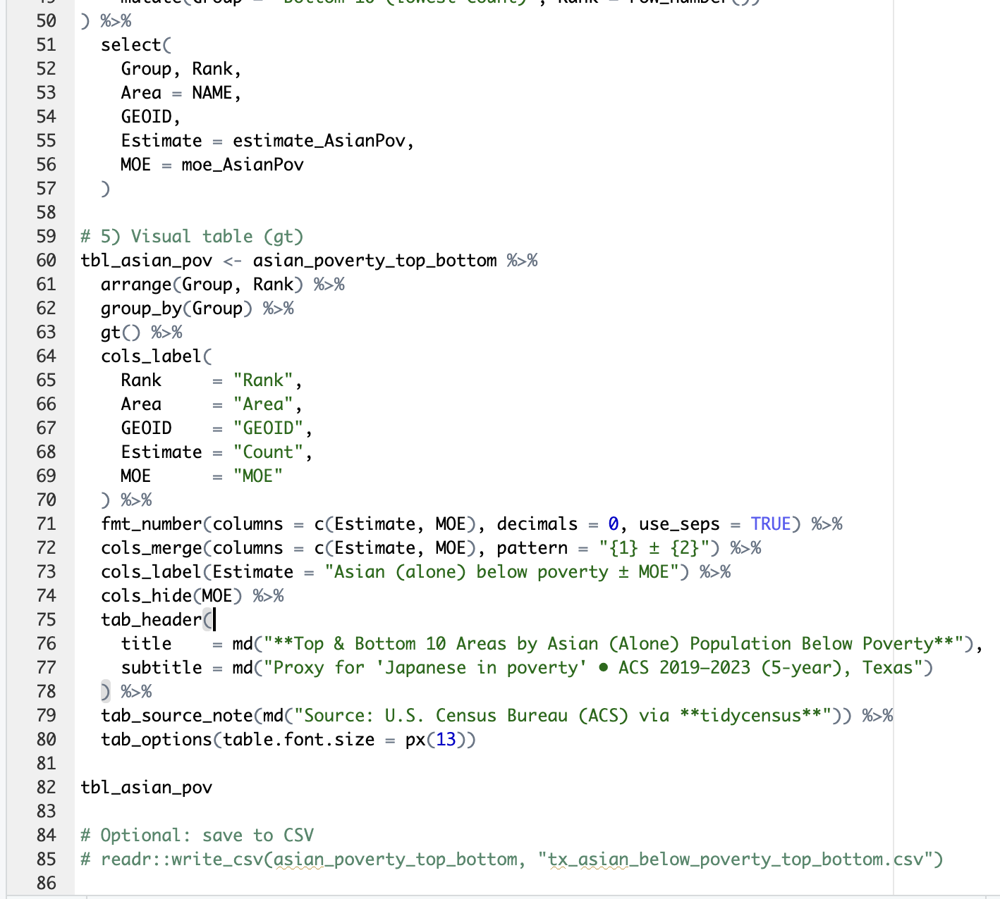

Objective:

Using *tidycensus* to retrieve ACS 2023 5 years estimates, to create a tidy data set, and to produce **one map and one table** along with an interpretation.

## 1. Set Up

The Census Key was obtained from the following website (https://api.census.gov/data/key_signup.html)

**API Key: ae35c975d8902be5656eaf5d7f3c5d36e1682a8e**

The following R packages were installed into R:

-   *tidycensus*

-   *tigris*

-   *sf*

-   *dplyr*

-   *ggplot2*

-   *readr.*

The API key was then put into R using the following R-Script:

**census_api_key("ae35c975d8902be5656eaf5d7f3c5d36e1682a8e", install = FALSE).**

## 2. Geography and Variables

Chosen Location: *Texas, USA*

The variables were searched using the following R-script: **load_variables(2023, "acs5", cache = TRUE)**

Variables:

**B02015_004: Estimate Total: East Asian - Japanese - Asian Alone by Selected Groups**

**B17001_054: Income in the past 12 months at or above poverty level - Female - 25 to 34 years - Poverty Status in the Past 12 Months by Sex by Age**

## 3. Downloading the data

R-Script:

## 4. Deliverables and Interpretation

Map: 

Table: 

R-Script for Table:

Interpretation:

Map: The map shows and visualizes where Japanese residents are most numerous in. There is a heavy concentration in major cities, such as Dallas, Houston, Austin, and San Antonio. It is very low or near-zero in rural areas, which is expected due to the population settlement. The table ranks the top/bottom 10 tracts by the Japanese population below poverty. The two visuals are related due to the clustering of the Japanese population can be directly correlated with the level of poverty within the counties that are shown in the table.
