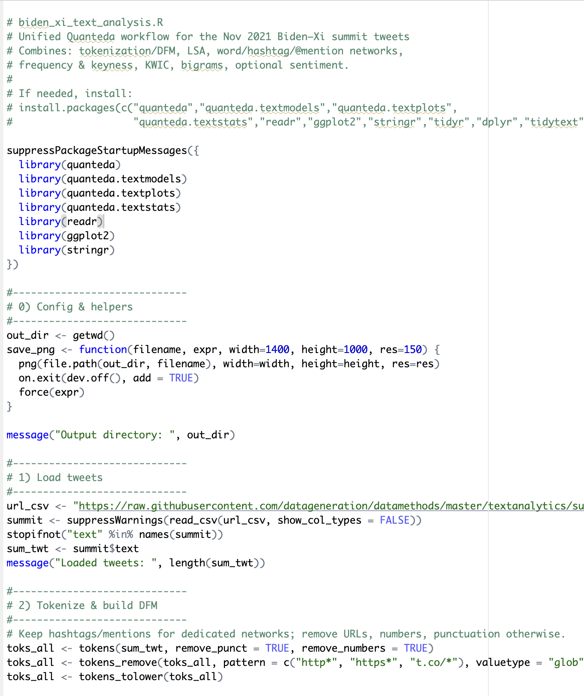
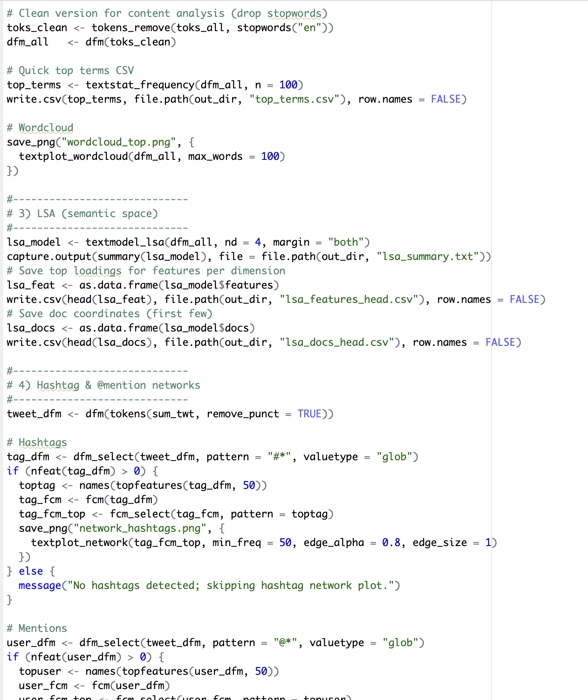
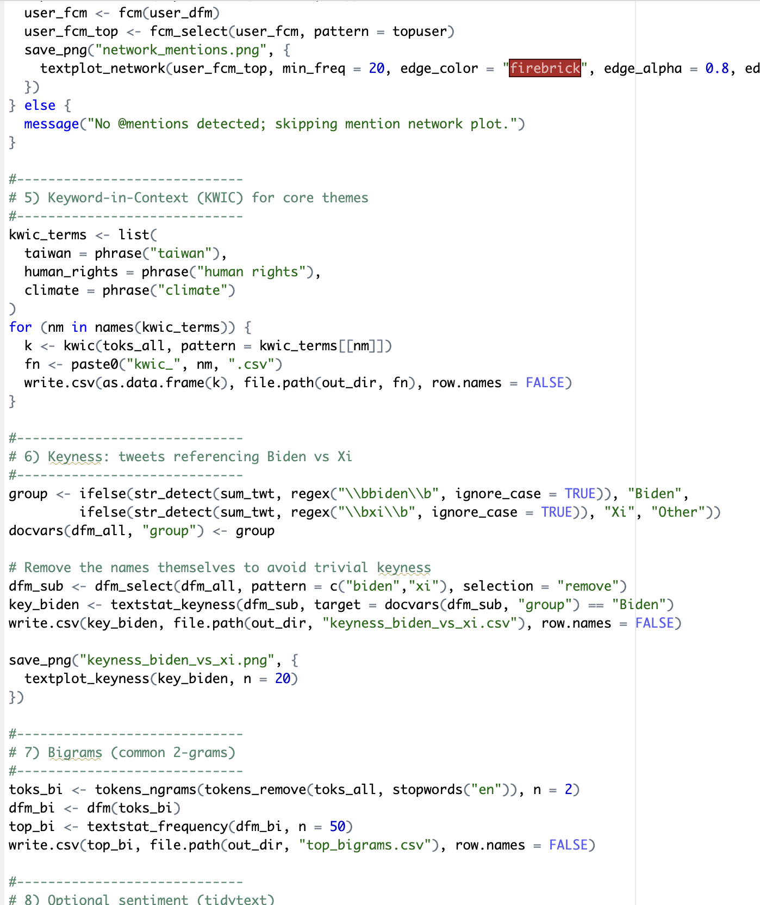
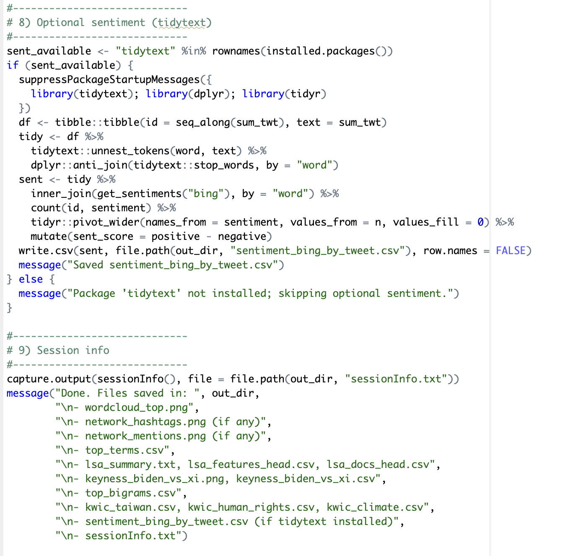
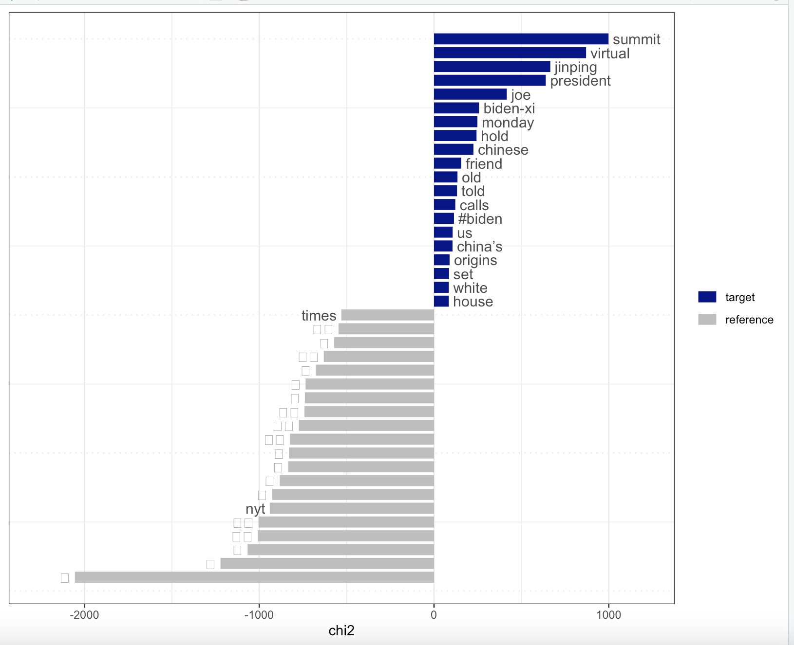

## Text Analytics using Quanteda

1.  What is **Quanteda**?

[**Quanteda**]{.underline} is an R package used for managing and analyzing text. Designed for users needing to apply natural language processing (NLP) to texts. Examples of this include:

-   Turning raw text into structured data

-   Makes it easier to analyze patterns and topics

-   Supports reproducible and quantitative text research

The API is designed to enable powerful, efficient analysis with a minimum of steps.

Info taken from: **https://quanteda.io/**

------------------------------------------------------------------------

2.  Download quanteda_textanalytic01.R/quanteda_textanalytic02.R

------------------------------------------------------------------------

3.  Analyze:

    a\. **Biden-Xi summit data**:

    

|    b. **US Presidential inaugural speeches**
| - Any similarities and differences over time and among presidents?

The blue bars (target) represent words that appear much more often in the Biden related tweets. The gray bars (reference) represent the words that appear more often in the Xi related tweets.

Target: - Common Words: Summit, virtual, Jinping, president, Joe, Biden-Xi, Monday, Chinese, Friend, White House, and Calls.

What do these mean? The words emohaize diplomatic relations and highlight formal engagement. They also describe the event itself and are more U.S. focused.

Reference: - Common Words: NYT, Times

What do these mean? The words, though few, appear to be more media and context driven. It focuses more on outside reporting and commentary rather than the speeches themselves.

4.  What is Wordfish?

Wordfish is a text scaling model with the goal to measure and place each document in a corpus into a continuous, one-dimensional scale.

It is super useful within the Data Analytics field because its unsupervised do we dont have to define beforehand what the dimension means or label any documents. It lets you compare and visualize doucments espeically in

Info taken from: https://quanteda.io/
