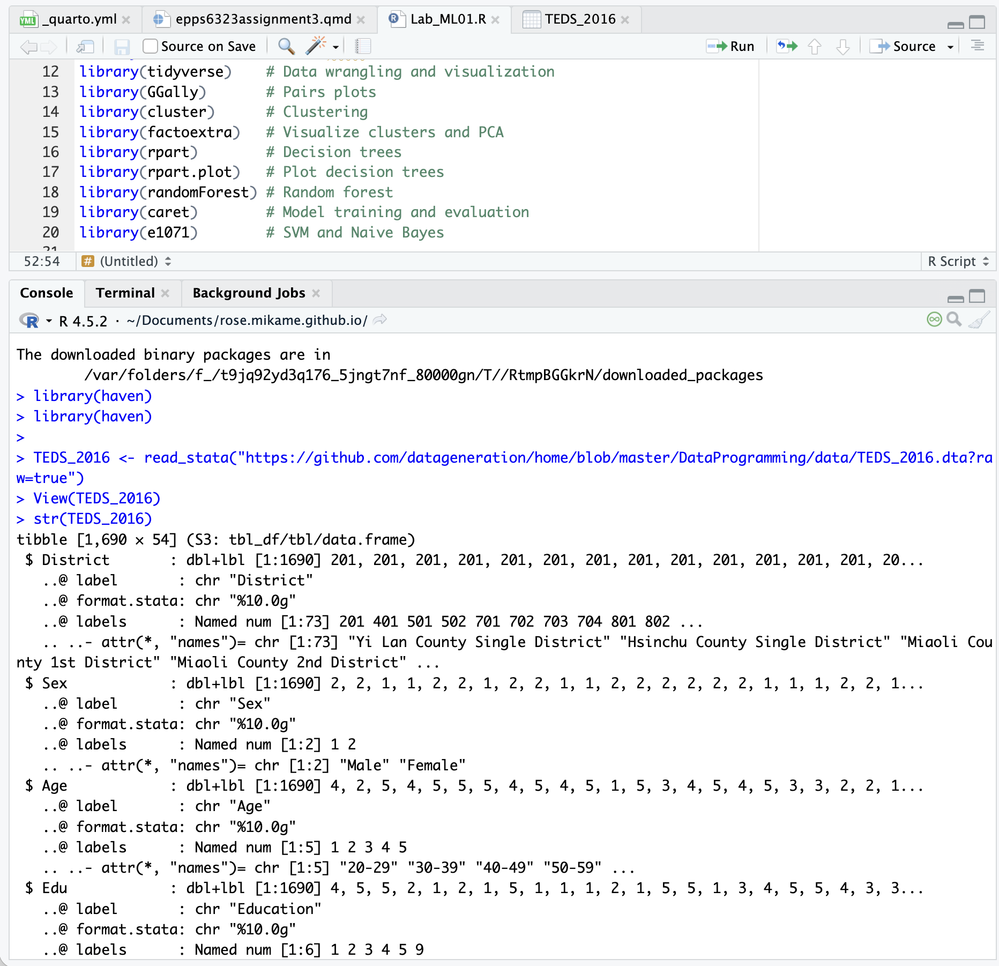
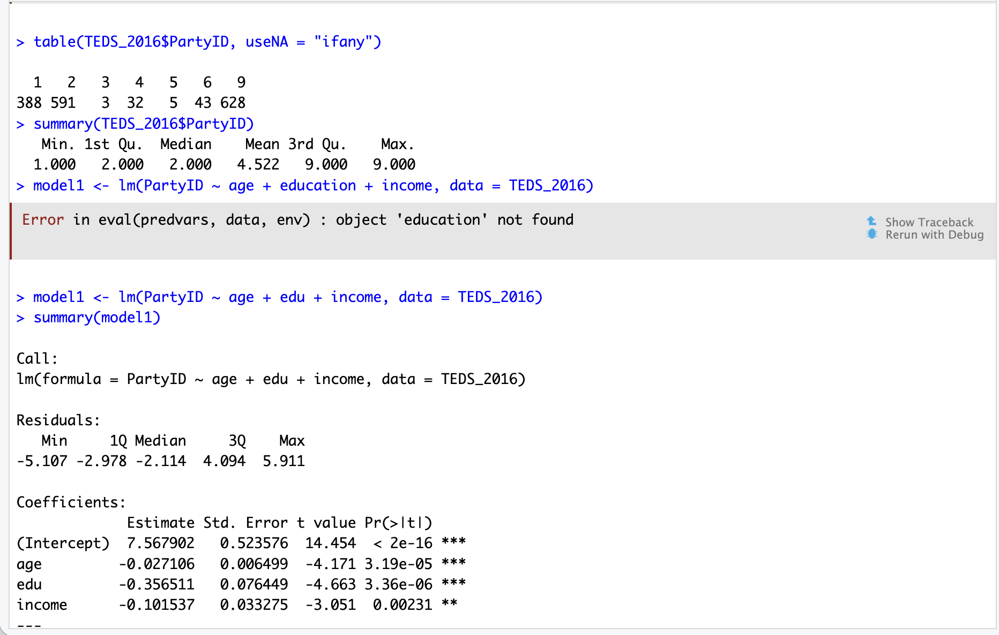
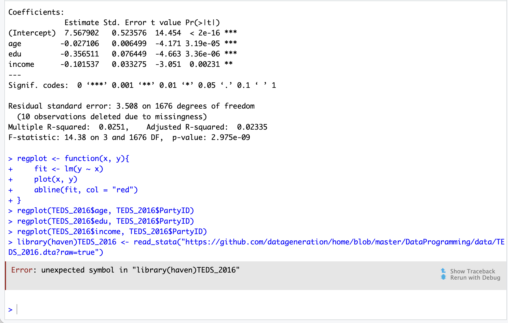
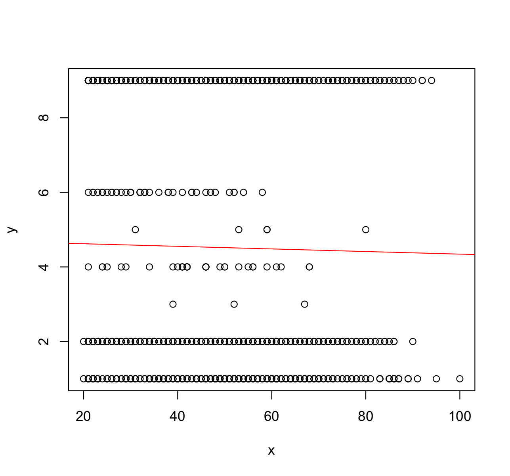
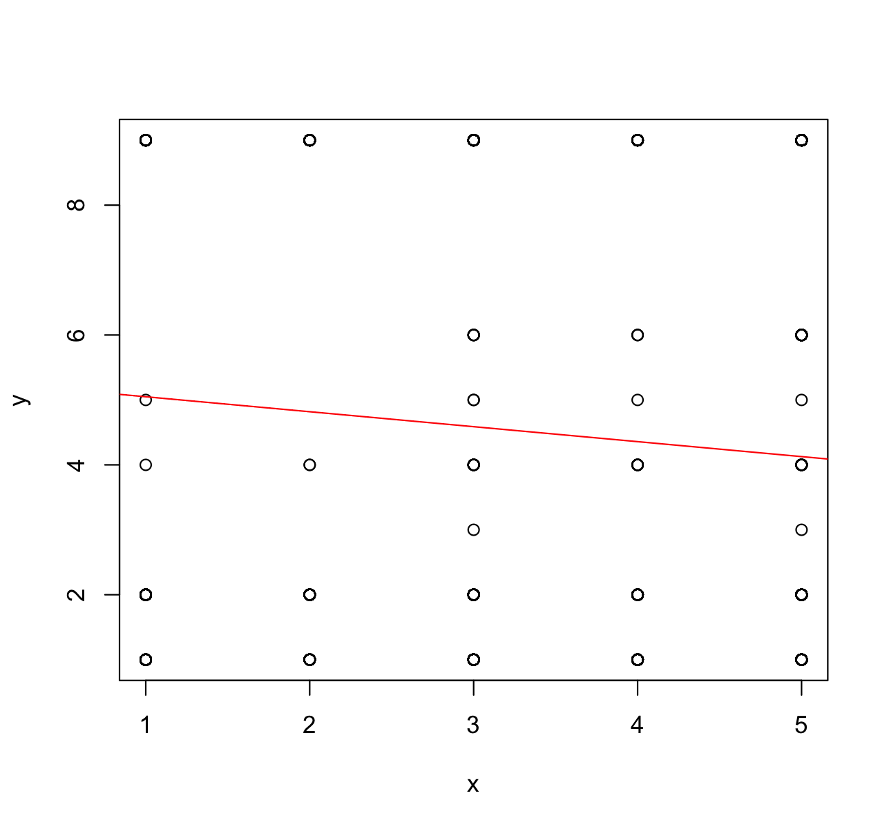
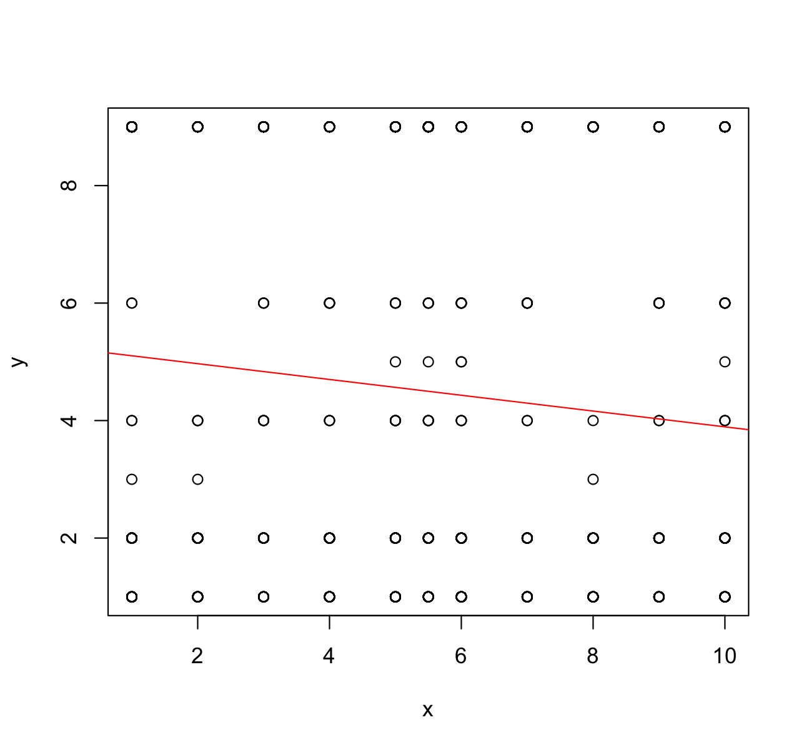

## ML Exercise

1.  Review ISLR Chapter 3

    **Chapter 3** introduces **linear regression**, a simple but foundational method for predicting a quantitative response. Though it may seem basic compared to newer techniques, understanding it well is essential before moving on to more advanced models.

2.  Run **Lab_ML01.R**:

       

3.  Use TEDS2016 data set to run a multiple regression model. Access the data set using the following codes:

```{r}
library(haven)
library(haven)

TEDS_2016 <- read_stata("https://github.com/datageneration/home/blob/master/DataProgramming/data/TEDS_2016.dta?raw=true")
```

4.  Write a function called regplot to plot a regression line.

```{r}
regplot <- function(x, y){
     fit <- lm(y ~ x)
     plot(x, y)
     abline(fit, col = "red")
}
regplot(TEDS_2016$age, TEDS_2016$PartyID)
regplot(TEDS_2016$edu, TEDS_2016$PartyID)
regplot(TEDS_2016$income, TEDS_2016$PartyID)
```

5.  The regression plots created from the codes above :

    a\. Age: 

    b\. Education: 

    c\. Income: 

6.  What is the problem and why?

    The issue is that multiple regression and regression plots work best when the dependent variable is continuous. The dependent variable is categorical, not continuous. A categorical dependent variable does not meet the assumption of a continuous outcome. Due to this, the model can produce inaccurate or unrealistic predictions.

7.  What can be done to improve prediction of the dependent variable?

    To improve the prediction, a model designed for categorical outcomes should be used. If the dependent variable is a binary number, the logistic regression would be more appropriate. If it has more than two categories, a multinomial or ordinal logistic regression would be a better fit.
